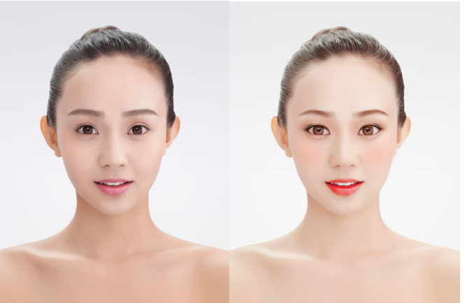

# 开源212点人脸关键点SDK实现抖音实时妆容修改

## 美颜和短视频

美颜相关APP可以说是现在手机上的必备的软件，例如抖音，快手，拍出的“照骗”和视频不加美颜效果，估计没有人敢传到网上。很多人一直好奇美颜类APP是如何开发出来的。本文就大致讲一下在Android上如何实现实时大红唇效果。


下图的红唇效果就是想实现的功能
<br>


## 美颜原理

美颜是的基本原理就是深度学习加计算机图形学。深度学习用来人脸检测和人脸关键点检测。计算机图形学用来磨皮，瘦脸和画妆容。一般在Android上使用OpenGLES，IOS为Metal。由于计算机图形学概念较多和复杂，本文中用Android的Canvas替代。

## 人脸检测 & 人脸关键点
1. 人脸检测指的是对图片或者视频流中的人脸进行检测，并定位到图片中的人脸。
2. 人脸关键点检测是对人脸中五官和脸的轮廓进行关键点定位，一般情况下它紧接在人脸检测后。


我们将使用TengineKit来实现实时大红唇效果。

## TengineKit
免费移动端实时人脸212关键点SDK。是一个易于集成的人脸检测和人脸关键点SDK。它可以在各种手机上以非常低的延迟运行。
<br>
https://github.com/OAID/TengineKit

### TengineKit 效果图


## 实现口红效果

### 配置 Gradle

Project中的build.gradle添加

```java
    repositories {
        ...
        mavenCentral()
        ...
    }

    allprojects {
        repositories {
            ...
            mavenCentral()
            ...
        }
    }
```

主Module中的build.gradle添加

```java
    dependencies {
        ...
        implementation 'com.tengine.android:tenginekit:1.0.3'
        ...
    }
```


### 配置 manifests

```xml
    <uses-permission android:name="android.permission.ACCESS_NETWORK_STATE" />
    <uses-permission android:name="android.permission.INTERNET"/>

    <uses-permission android:name="android.permission.READ_EXTERNAL_STORAGE"/>
    <uses-permission android:name="android.permission.WRITE_EXTERNAL_STORAGE"/>
    <uses-permission android:name="android.permission.READ_PHONE_STATE"/>

    <uses-permission android:name="android.permission.CAMERA"/>
    <uses-permission android:name="android.permission.FLASHLIGHT" />

    <uses-feature android:name = "android.hardware.camera" android:required="true"/>
    <uses-feature android:name = "android.hardware.camera.autofocus" />
```

摄像头相关,TengineKit初始化代码可以看这篇问题，都是重复性内容就不在这里写了

> 用开源212点人脸关键点实现Android人脸实时打码
> https://zhuanlan.zhihu.com/p/161038093

### 通过关键点得到嘴唇的形状

```java
    Path getMouthLandmarks(FaceLandmarkInfo fi){
        Path outPath = new Path();
        outPath.moveTo(fi.landmarks.get(180).X,fi.landmarks.get(180).Y);
        for(int i = 180; i < 189; i++){
            outPath.lineTo(
                    fi.landmarks.get(i).X,
                    fi.landmarks.get(i).Y
            );
        }
        for(int i = 204; i >= 196; i--){
            outPath.lineTo(
                    fi.landmarks.get(i).X,
                    fi.landmarks.get(i).Y
            );
        }

        outPath.close();

        Path inPath = new Path();
        inPath.moveTo(fi.landmarks.get(180).X,fi.landmarks.get(180).Y);

        for(int i = 195; i >= 188; i--){
            inPath.lineTo(
                    fi.landmarks.get(i).X,
                    fi.landmarks.get(i).Y
            );
        }
        for(int i = 204; i <= 211; i++){
            inPath.lineTo(
                    fi.landmarks.get(i).X,
                    fi.landmarks.get(i).Y
            );
        }

        outPath.op(inPath, Path.Op.DIFFERENCE);
        return  outPath;
    }
```

### 给嘴唇涂上颜色

```java
    public static void drawLipPerfect(Canvas canvas, Path lipPath, int color, int alpha) {
        //most 70% alpha
        if (alpha > 80) {
            alpha = (int) (alpha * 0.9f + 0.5f);
        }

        alpha = (int) (Color.alpha(color) * ((float) alpha / 255)) << 24;
        color = alphaColor(color, alpha);
        final PointF position = new PointF();
        float blur_radius = 5;

        Bitmap mask = createMask(lipPath, color, blur_radius, position);

        Paint paint = new Paint(Paint.ANTI_ALIAS_FLAG);
        paint.setXfermode(new PorterDuffXfermode(PorterDuff.Mode.SRC_OVER));
        canvas.drawBitmap(mask, position.x, position.y, paint);
    }
```
此代码来源于 https://github.com/DingProg/Makeup

### 渲染

```java
    trackingOverlay.addCallback(new OverlayView.DrawCallback() {
        @Override
        public void drawCallback(final Canvas canvas) {
            if(faceBitmap != null){
                canvas.drawBitmap(faceBitmap, 0,0, null);
            }
            if(faceLandmarks != null){
                for (int i = 0; i < faceLandmarks.size(); i++) {
                    Path m_p = getMouthLandmarks(faceLandmarks.get(i));
                    LipDraw.drawLipPerfect(canvas, m_p, Color.RED, 120);
                    Rect r = faceLandmarks.get(i).getBoundingBox();
                }
            }
        }
    });
```

### 效果

## 建议

有兴趣的同学可以在当前项目的基础上面深化，具体可以参考
<br>
https://github.com/DingProg/Makeup

更进一步想尝试商业级的美颜效果可以参考
<br>
https://github.com/CainKernel/CainCamera

## 参考

1. [TengineKit - Free, Fast, Easy, Real-Time FaceDetection & FaceLandmark SDK on Mobile.](https://github.com/OAID/TengineKit)

2. [Makeup - 让你的“女神”逆袭，代码撸彩妆（画妆） ](https://github.com/DingProg/Makeup)

3. [CainCamera - CainCamera is an Android Project to learn about development of beauty camera, image and short video](https://github.com/DingProg/Makeup)
